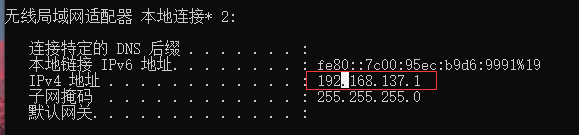
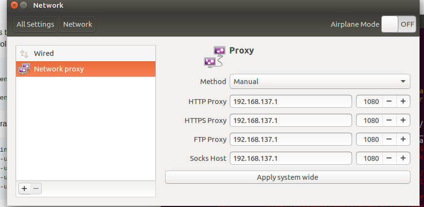

## vmware system can use host ssr access to internet ，VM用主机ssr上网

### 1. Make sure your windows system can use ssr to internet 
     And alow local proxy like this.

  

### 2. Setting vmvare network adapter

  

 
### 3. Get your host ip 

  

       

### 4. Setting vitural system(ubuntu) network proxy 
       use your local host ip and port 1080 record to step1 ssr 

  

reference to  https://blog.csdn.net/u012267725/article/details/77411161
